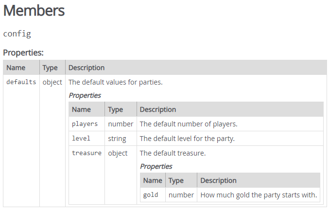

# 객체 리터럴 주석
### 객체 리터럴 주석

**타입 주석**

- 객체 리터럴은 문서화가 되지 않아 @class 태그를 사용한다.

```jsx
/**
 * 사용자 정보 객체
 * @class User
 */
let User = {
}
```

**프러터티 주석** 

- 객체 리터럴의 정적 프러퍼티는 @type사용 또는 @property 도 가능

```jsx
/**
 * 사용자 정보 객체 
 * @class User
 */
let User = { 
   /** 
  * @type{string} id 사용자 아이디
  * */
  id: 1,
}
```

**객체 리터럴의 함수 주석** 

- 함수 주석과 동일하게 작성

```jsx
/**
 * 사용자 정보 객체 
 * @class User
 */
let User = { 
   /** 
  * @property {string} id 사용자 아이디
  * */
  id: 1,
  /** @property {string} name 사용자 이름 */
  name: "Hong",
  /**
   * 사용자 이름 반환
   * @returns { strring } 이름을 반환
   */
  getName : function() {
    return this.name; 
  },
  /**
   * 타입에 맞는 주소를 반환한다.
   * @param {String} addrType 어드레스 타입
   * @returns {string} 주소
   */ 
  getRealAddress: function(addrType) {
    return "서울"; 
  }
}
```

**객체 안의 객체 주석**

```jsx
/**
   * 함수 모음 객체 
   * @class fn
   * @memberof User
   */
  fn : {
    /**
     * 이름을 구한다.
     * @returns {string} 이름 반환
     * @memberof User.fn
     */
    getName : function() {
      return ""
    },
    /**
     * 타입에 맞는 사용자 주소를 반환한다. 
     * @param {string} adrType 주소 타입
     * @returns {string} 사용자 주소
     */
    getAddress: function(adrType) { 
      return "Seoul";
    }
  }
```

**전체 코드**

```jsx
/**
 * 사용자 정보 객체 
 * @class User
 */
let User = { 
  /**
   * 사용자 이름
   * @type {string} 
   */
  name: "Latte", 
  /**
   * 함수 모음 객체 
   * @class fn
   * @memberof User
   */
  fn : {
    /**
     * 이름을 구한다.
     * @returns {string} 이름 반환
     * @memberof User.fn
     */
    getName : function() {
      return ""
    },
    /**
     * 타입에 맞는 사용자 주소를 반환한다. 
     * @param {string} adrType 주소 타입
     * @returns {string} 사용자 주소
     */
    getAddress: function(adrType) { 
      return "Seoul";
    }
  }
}
```

**property 만 있는 객체 리터럴 주석**

- @property를 사용한다.

```jsx
/**
 * @property {object}  defaults               - The default values for parties.
 * @property {number}  defaults.players       - The default number of players.
 * @property {string}  defaults.level         - The default level for the party.
 * @property {object}  defaults.treasure      - The default treasure.
 * @property {number}  defaults.treasure.gold - How much gold the party starts with.
 */
 var config = {
  defaults: {
      players: 1,
      level:   'beginner',
      treasure: {
          gold: 0
      },

      /**
       * 숫자를 반환한다. 
       * @returns {number} 숫자
       */
      getNumber: function() {
        return 0;
      }
  }
};

```

다음과 같이 문서가 만들어진다. 

> **메서드를 문서화 하기 어렵다.**

 


[https://jsdoc.app/tags-property.html](https://jsdoc.app/tags-property.html)