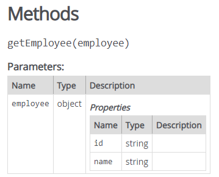
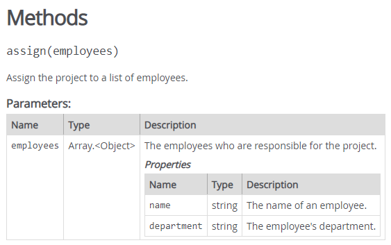
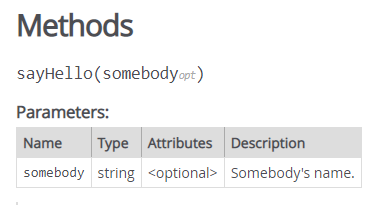
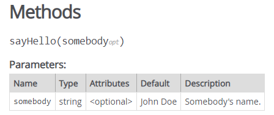
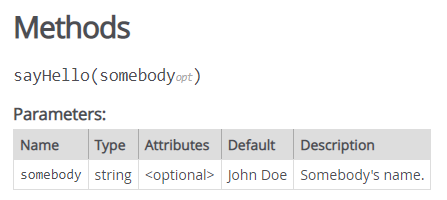
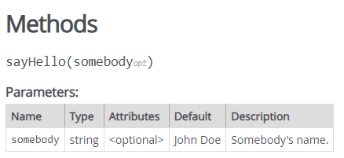
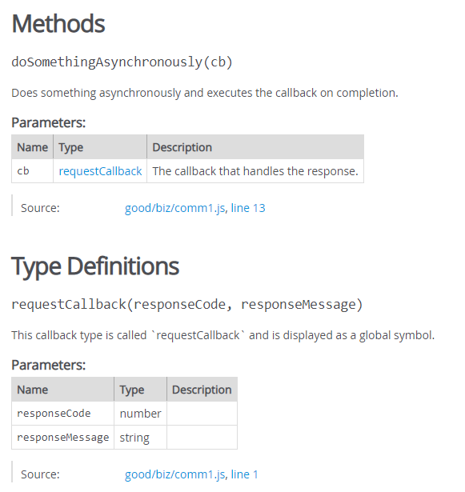

# @param 태그 사용 


@param 태그를 사용하는 방법을 알아 보자. 

- string, number, object, * 등을 사용할 수 있다.
- 배열은 []을 사용한다.

### 사용 방법

**이름만 나열**

```jsx
/**
 * @param somebody
 */
function sayHello(somebody) {
    alert('Hello ' + somebody);
}
```

**이름과 타입 나열**

```jsx
/**
 * @param {string} somebody
 */
function sayHello(somebody) {
    alert('Hello ' + somebody);
}
```

**이름, 타입 그리고  설명**

```jsx
/**
 * @param {string} somebody Somebody's name.
 */
function sayHello(somebody) {
    alert('Hello ' + somebody);
}
```

**hypen을 사용**

```jsx
/**
 * @param {string} somebody - Somebody's name.
 */
function sayHello(somebody) {
    alert('Hello ' + somebody);
}
```

**파라미터의 프러퍼티 표시** 

파라미터가 object이고 object의 프러퍼티를 표시하고 있으면 다음과 같이 한다.

```jsx
/**
 * Assign the project to an employee.
 * @param {Object} employee - The employee who is responsible for the project.
 * @param {string} employee.name - The name of the employee.
 * @param {string} employee.department - The employee's department.
 */
Project.prototype.assign = function(employee) {
    // ...
};
```

함수에서 다음과 같이 정의해 보았다. 

```jsx
/**
 * @param {object} employee 
 * @param {string} employee.id 
 * @param {string} employee.name 
 */
function getEmployee(employee) {
  //..
}
```

다음 그림과 같은 문서가 생성된다. 




**파라미터가 배열인 경우**

```jsx
/**
 * Assign the project to a list of employees.
 * @param {Object[]} employees - The employees who are responsible for the project.
 * @param {string} employees[].name - The name of an employee.
 * @param {string} employees[].department - The employee's department.
 */
assign = function(employees) {
  // ...
};
```



**파라미터가 optional인 경우**

```jsx
/**
 * @param {string} [somebody] - Somebody's name.
 */
 function sayHello(somebody) {
  if (!somebody) {
      somebody = 'John Doe';
  }
  alert('Hello ' + somebody);
}
```




**옵션널이고 디폴트 값이 있을 때**

```jsx
/**
 * @param {string} [somebody=John Doe] - Somebody's name.
 */
 function sayHello(somebody) {
  if (!somebody) {
      somebody = 'John Doe';
  }
  alert('Hello ' + somebody);
}
```




하나 이상의 타입을 지정할 수 있을 때

```jsx
/**
 * @param {(string|string[])} [somebody=John Doe] - Somebody's name, or an array of names.
 */
 function sayHello(somebody) {
  if (!somebody) {
      somebody = 'John Doe';
  } else if (Array.isArray(somebody)) {
      somebody = somebody.join(', ');
  }
  alert('Hello ' + somebody);
}
```



**모든 타입 허용**

```jsx
/**
 * @param {*} somebody - Whatever you want.
 */
 function sayHello(somebody) {
  console.log('Hello ' + JSON.stringify(somebody));
}
```




**콜백 함수 정의** 

@callback을 사용하여 콜백을 정의한다.

```jsx
/**
 * This callback type is called `requestCallback` and is displayed as a global symbol.
 *
 * @callback requestCallback
 * @param {number} responseCode
 * @param {string} responseMessage
 */

/**
 * Does something asynchronously and executes the callback on completion.
 * @param {requestCallback} cb - The callback that handles the response.
 */
 function doSomethingAsynchronously(cb) {
  // code
};
```



